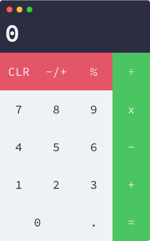

# Abacus Plus

## Download now
[View Releases](https://github.com/jbrain4/AbacusPlus/releases)

## Build it yourself
### Before you begin
After cloning the repository, you will need to do the following:
1. Initialize npm with `npm init` in the cloned repository.
2. Install electron with `npm install --save-dev electron` (you may need elevated privileges)
3. Download the latest version of Adobe's SourceCodePro font from [GitHub](https://github.com/adobe-fonts/source-code-pro) or [Google Fonts](https://fonts.google.com/specimen/Source+Code+Pro) and put the Regular and Medium variants in the 'fonts' directory in the cloned repository.

### Building
To build Abacus Plus, you will need to
1. Install `electron-packager` with `npm install -g electron-packager` first.
2. Run `npm run package-win` or `npm run package-mac` or `npm run package-linux` based on the platform you are compiling for.
3. The compiled executable is located in the `release-builds` directory

## Run Before You Build
If you just want to run it before you build it you just need to run `npm start`
